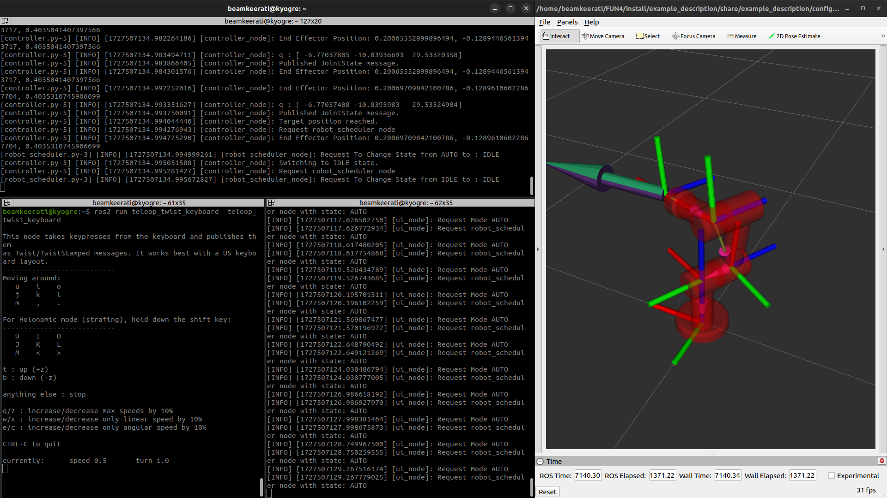
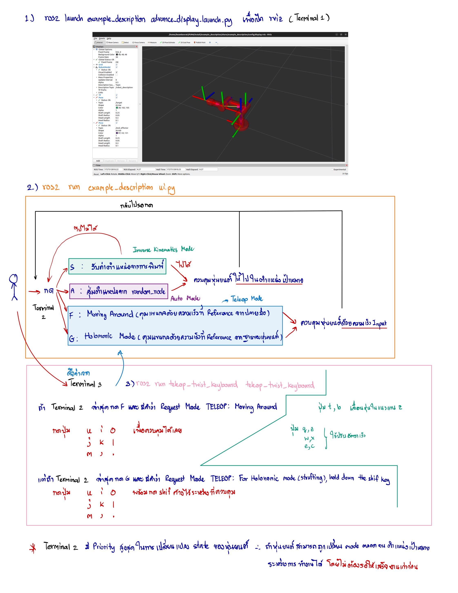

# Hello World 3R Manipulator

A simulation system of a 3R robotic arm that does not take into account collisions and forces, controlled via CLI and displayed via RVIZ. Support Only **Ubuntu 22.04 LTS**.



## Features

- Can be run by opening only 3 files.
- Arrows indicate the position of the End-effector **(purple)** and the Target position **(green)**.
- Every step of the work process is displayed with logs, supporting Exception Handling.
- Supports 3 working modes: Auto, Inverse, Teleop
- Prevent movements that will cause a singularity by checking through the determinant of the Jacobian matrix.


## Installation

**Install ROS2 Humble**

[Install ROS 2 packages](https://docs.ros.org/en/humble/Installation/Ubuntu-Install-Debs.html)

**Install dependencies**

```bash
    pip3 install numpy==1.26.4
    pip3 install roboticstoolbox-python
    sudo apt install ros-humble-desktop-full
    sudo apt install ros-dev-tools
    sudo apt install ros-humble-teleop-twist-keyboard
```

Go somewhere like your home directory and clone this package.

```bash
    git clone https://github.com/beamkeerati/FUN4
    cd FUN4/
```
then build (inside FUN4)

```bash
    colcon build && . install/setup.bash
```
Set up your environment by sourcing the following file.

```bash
    echo "source ~/FUN4/install/setup.bash" >> ~/.bashrc
```
## Usage

The rough usage method is as follows:



**Open 3 Terminals in order and leave them running so that all three can run simultaneously.**

**Terminal 1**
```bash
    ros2 launch example_description advance_display.launch.py
```
**Terminal 2**
```bash
    ros2 run example_description ui.py
```
**Terminal 3**
```bash
    ros2 run teleop_twist_keyboard  teleop_twist_keyboard
```
## Control
- To change the robot's state, move the mouse to click on **Terminal 2** and press the **s,a,f,g** keys to **change the mode**.
- When in Teleop mode, to control the End-Effector, hover your mouse over **Terminal 3** and press the **u i o j k l m , .** buttons to control the robot's movement. If it's a Holomonic, **hold down shift throughout** the control.
- You can explore the details and movement characteristics by trying it yourself. Open Terminal 3 and observe the results.

## Calculating the Workspace of a Robot
- Refer to `Convert.ipynb` for the Modified-DH Parameters and workspace calculations.
- Refer to `InverseKinematics.ipynb` for using a P-Controller with the inverse Jacobian to solve for the joint angles $q$ of each joint and to simulate the controller iteratively.
